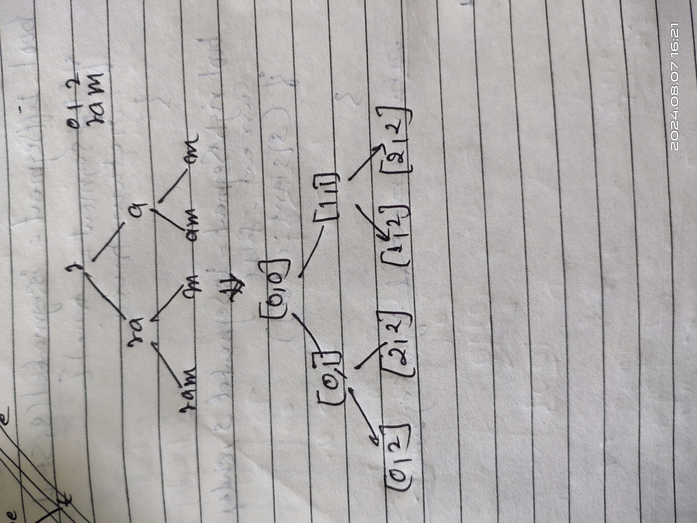

# [139. Word Break](https://leetcode.com/problems/word-break/description/)

`Medium` `Array` `Dynamic Programming` `Hash Table` `String` `Trie`

## Key Points

- First of try to make decision tree you will automatically figure it out.
- Try decision tree where when you go left you don't segment the word but when you go right you segment the given word
- Rather to keep the segmented string with use we will keep its starting and ending positions.
-

## Example:

s = "ram"



## Approaches

### 1. Only recursion

    Time Complexity: O(2 ^ n) where n is the length of the string.
    Space Complexity: O(n ^ 2) dp array takes n * n memory and call stack also take O(n) time because at one time n calls can be present in call stack, Think why.

    NOT EFFICIENT, if you wanna try it remove the dp code from below it will become pure recursive

### 2. Memoization (Top Down approach)

Time Complexity: O(N ^2)
Space Complexity: O(N ^ 2)

```c++
class Solution {
public:

    bool wordBreakUtil(string s, unordered_set<string> &dict, int start, int end, vector<vector<int>> &dp){
        // when both index went outside the bound
        if (end == start && end >= s.length()) {
            return false;
        }

        if (end >= s.length()) {
            return dict.find(s.substr(start, end - start)) != dict.end();
        }

        if (dp[start][end] != -1) {
            return dp[start][end];
        }

        bool leftSegment = wordBreakUtil(s, dict, start, end + 1, dp);
        // if left segment gives us ans from some start index to till end then we don't need to break the string again so return
        if (leftSegment) {
            return true;
        }
        // here we need to break it
        bool rightSegment = wordBreakUtil(s, dict, end + 1, end + 1, dp);
        // if the current present is present in dictionary and string to the right is also found then return true. otherwise return false.
        bool currentSegment = false;
        if (dict.find(s.substr(start, end - start + 1)) != dict.end()) {
            currentSegment = true;
        }
        return dp[start][end] = rightSegment && currentSegment;
    }

    bool wordBreak(string s, vector<string>& wordDict) {
        vector<vector<int>> dp(s.length(), vector<int>(s.length(), -1));
        unordered_set<string> dict(wordDict.begin(), wordDict.end());
        return wordBreakUtil(s, dict, 0, 0, dp);
    }
};
```

### 2. Tabulation Approach

    Time Complexity: ..
    Space Complexity: ..

```c++
   DO It as a revision.
```
